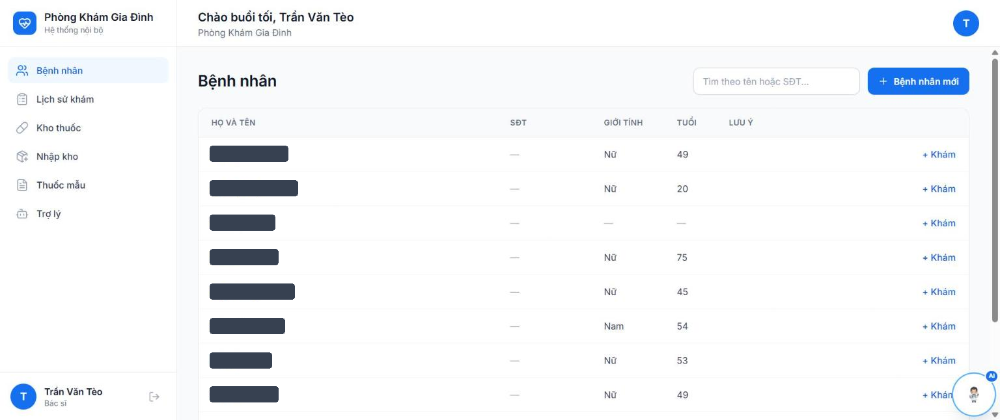

# Medical Web — Clinic Management System

An internal clinic management system for independent family-practice doctors. Each doctor works as a **fully isolated tenant**: their own patients, their own medicine stock, their own prescriptions and templates — invisible to every other account on the same deployment.

Built solo: Spring Boot API, Next.js web client, PostgreSQL, deployed and running in production.

| | |
|---|---|
| **Web app** | https://medical-web-lime.vercel.app |
| **API health** | https://clinic-backend-9e93.onrender.com/actuator/health |
| **Stack** | Java 21 · Spring Boot 3 · PostgreSQL · Next.js 16 · React 19 · Tailwind CSS · Docker |

<!--
ẢNH CHỤP MÀN HÌNH — thêm vào đây, đây là thứ quyết định người ta có đọc code hay không.
Chụp 3 ảnh, lưu vào docs/screenshots/, rồi bỏ comment 3 dòng dưới:




-->

---

## The problem

A family clinic runs on paper: the doctor writes the prescription by hand, counts stock by memory, and has no history to look back on when the same patient returns three months later. Off-the-shelf hospital software is priced and shaped for hospitals — multi-department, multi-role, and far more system than one doctor needs.

This system targets the smallest useful unit: **one doctor, one clinic, one screen flow** — create patient → open visit → diagnose with ICD-10 → prescribe → print. Stock is deducted automatically as a side effect of prescribing, because a step that must be remembered is a step that gets skipped.

## Features

**Patients** — create/edit with drug allergies and chronic conditions as explicit flags, accent-insensitive search by name or phone (typing `nguyen van a` finds `Nguyễn Văn Á`), and full visit history per patient.

**Visits & ICD-10** — diagnosis is mandatory. ICD-10 lookup works both ways: type a code and the name fills in; type part of a name and you get matching codes. Both code and name are snapshotted onto the visit, so renaming a code later never rewrites medical history.

**Prescriptions & stock** — one prescription per visit, with four-slot dosing (morning/noon/afternoon/evening), usage notes and day counts. Creating a visit writes the visit, the prescription and the stock deduction **inside a single transaction**: either all three happen or none do.

**Unit conversion** — medicines are stored in a base unit with a conversion ladder (`chai → hộp → vỉ → viên`). Stock is held as a single base quantity and rendered back in human units, so 150 tablets reads as *"2 hộp 3 vỉ 5 viên"* rather than a raw number the doctor has to divide in their head.

**Stock orders** — draft an order, receive it to add stock, or export it to `.xlsx` to send to a supplier. Quick suggestions are generated from what is running low.

**Prescription templates** — frequently used medicines with default doses, suggested first in the prescribing autocomplete.

**Assistant chat** — natural-language questions over the doctor's own data (*"which medicines are running low?"*, *"how many patients this month?"*). See [Why the assistant does not write SQL](#why-the-assistant-does-not-write-sql).

**Printing** — the visit page renders a printable prescription through `@media print` rules: clinic name, doctor, patient, diagnosis and the dosing table, with the print timestamp recorded back to the API.

---

## Architecture

```
[Browser — doctors and admin only; no public pages besides login]
   │
   ├── Next.js (Vercel) — login + management app
   │        │  REST over HTTPS, JWT bearer
   │        ▼
   └── Spring Boot API (Render) — all business logic
            │      EVERY doctor-scoped query filters doctor_id taken from the JWT
            ├── PostgreSQL (Supabase)
            ├── Supabase Auth — identity;  Supabase Storage — medicine images
            └── Gemini — intent classification only (never touches the database)
```

The API is a layered monolith organised by domain (`patient`, `visit`, `medicine`, `stock`, `chat`, `admin`, `auth`, `storage`), not by technical layer — a change to prescribing touches one package.

### Security model

Data isolation was the number-one requirement, so it is enforced where it cannot be bypassed:

- **`doctor_id` comes from the JWT subject, never from the request body.** Every service method takes a `doctorId` argument and every repository query carries a `doctor_id` predicate. A client that guesses another doctor's patient UUID gets a 404, not someone else's record.
- **Isolation lives in the API layer, not the UI.** Hiding a button hides nothing, so isolation was verified by attacking the endpoints directly with Postman: signing in as doctor A and requesting doctor B's patient, visit and medicine IDs, which return 404 rather than data. Automated coverage for this is the next thing the project needs.
- **`is_blocked` is checked on every request**, so revoking an account takes effect immediately rather than when the token expires.
- **Admin cannot read clinical data.** The admin role creates and blocks doctor accounts — there is no admin endpoint that returns a patient, visit, or prescription.
- **Row-level security** is enabled on `chat_messages`, and uploaded images are cleaned up by a scheduled job that skips recently uploaded files to avoid racing an in-flight upload.

### Why the assistant does not write SQL

The obvious way to build a data assistant is to let the model generate SQL. This one does not, and the reason is the security model above: a model that can emit arbitrary SQL can emit SQL without a `doctor_id` filter, and one prompt injection away is another doctor's patient list.

Instead, Gemini only ever returns `{intent, params}` as JSON. The backend validates `intent` against a whitelist and runs a **pre-written query that already binds `:doctorId`**. The model chooses *which* question is being asked; it never chooses what data is reachable. Unrecognised intents are rejected rather than guessed at.

Date handling follows the same rule: the client sends keywords (`TODAY`, `THIS_MONTH`), and the server resolves them against its own clock. The clock on a doctor's laptop does not get to decide what "today" means.

### Latency work

The assistant started at ~1.4s per turn. Measured on production, that split roughly into ~190ms network, ~460ms database (five round-trips), ~740ms Gemini. Three changes, each aimed at a specific slice:

1. **Suggestion chips skip the model entirely.** Tapping *"Which medicines are running low?"* is a fixed string whose intent is known ahead of time — the frontend sends the intent directly and the backend goes straight to the query template. Removes the LLM call and a context load. Security is unchanged: same whitelist, same `doctor_id` filter, same server-resolved dates.
2. **Intent classification is cached.** At temperature 0 and a fixed date, classification is a pure function of the question. The cache deliberately skips any turn that has conversational context (*"how many doses left?"* only means something given the previous turn), keys on the accented string (merging `Nguyễn Văn Á` with `Nguyen Van A` would return the wrong patient), and never caches `UNKNOWN` so one bad classification does not stick for the rest of the day.
3. **Chat logging moved to `@Async`.** The doctor already has their answer; they should not wait on an audit-log `INSERT`.

## Database

Schema evolution is managed with **Flyway** — 16 versioned migrations, including a mid-project pivot from a patient-facing product to an internal multi-doctor system (`V4`). Every environment rebuilds from source, and every schema change is reviewable as a diff.

Notable decisions in the schema:

- **Snapshot columns** on prescription items (`medicine_name`, `base_unit`) and visits (`diagnosis_code`, `diagnosis_name`) — a prescription printed last year must not change because a medicine was renamed this year.
- **Soft delete** (`deleted_at`) on visits, with an option to restore the medicines to stock when a visit is deleted.
- **Partial indexes** (`WHERE deleted_at IS NULL`) so the indexes only cover rows the application actually queries.
- **`unaccent`-based search** for Vietnamese names and medicine names.
- **Idempotency keys** on visit creation, so a double-submitted prescription does not deduct stock twice.
- **Stock may go negative** — by design. Reality does not stop because the count is off, and blocking a prescription over a bookkeeping error would push the doctor back to paper.

---

## Tech stack

| Layer | Choices |
|---|---|
| **Backend** | Java 21, Spring Boot 3 (Web MVC, Validation, Actuator), Spring Data JPA, Spring Security as an OAuth2 Resource Server |
| **Database** | PostgreSQL (Supabase), Flyway migrations |
| **Auth & storage** | Supabase Auth (JWT), Supabase Storage for medicine images |
| **Reporting** | Apache POI — `.xlsx` stock-order export |
| **Frontend** | Next.js 16 (App Router), React 19, TypeScript, Tailwind CSS 4, Radix UI |
| **AI** | Google Gemini — intent classification only |
| **Deployment** | Docker → Render (API), Vercel (web) |

## Running locally

Requirements: **JDK 21+**, **Node.js 20+**, and a PostgreSQL database (a free Supabase project works).

```bash
git clone https://github.com/Minh27032004/medical-web.git
cd medical-web

# ---- Backend ----
cd backend
cp .env.example .env          # database URL, Supabase keys, Gemini API key
./mvnw spring-boot:run        # http://localhost:8080 — Flyway migrates on startup

# ---- Frontend ----
cd ../frontend
cp .env.example .env.local    # API base URL + Supabase public keys
npm install
npm run dev                   # http://localhost:3000
```

Secrets live only in `.env` files and are git-ignored. `.env.example` in each module lists every variable the application reads.

## API overview

All endpoints sit under `/api` and require a JWT except the login resolver. Roles: `ROLE_ADMIN`, `ROLE_DOCTOR`.

| Group | Endpoints |
|---|---|
| Auth | `POST /auth/resolve-login`, `GET /me/profile` |
| Admin | `GET/POST /admin/doctors`, `PATCH /admin/doctors/{id}/block`\|`/unblock` |
| Patients | CRUD `/doctor/patients`, `?q=` search, `GET /{id}/visits` |
| ICD-10 | `GET /doctor/icd10?q=` — two-way code/name lookup |
| Medicines | CRUD `/doctor/medicines` (+units), `POST /{id}/adjust-stock`, `GET /low-stock`, `GET /suggest` |
| Templates | CRUD `/doctor/templates` |
| Stock orders | `GET/POST /doctor/stock-orders`, `POST /{id}/receive`, `GET /{id}/export` → `.xlsx` |
| Visits & Rx | `POST /doctor/visits` (visit + prescription + stock deduction, one transaction), `GET /doctor/visits?date=&from=&to=`, `GET /doctor/patients/{id}/last-prescription`, `POST /doctor/prescriptions/{id}/printed`, `DELETE /doctor/visits/{id}?restoreStock=` |
| Chat | `POST /doctor/chat` |

## Documentation

- [`docs/FEATURES.md`](docs/FEATURES.md) — functional specification
- [`docs/ARCHITECTURE.md`](docs/ARCHITECTURE.md) — architecture, ERD, API contract
- [`docs/DECISIONS.md`](docs/DECISIONS.md) — decision log (ADR)

## Status

Deployed and running. Not connected to Vietnam's national e-prescription network and not digitally signed, so it is an internal record system rather than a legally issuing one — the prescription schema keeps the fields that integration would need.

---

**Trần Nhật Minh** — [github.com/Minh27032004](https://github.com/Minh27032004) · nhatminhtran104@gmail.com
